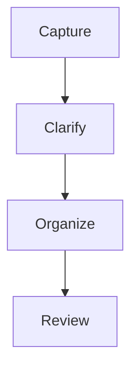

# Obsidian Markdown Rules

Use these rules when writing the JSON `content` field.

Do not include YAML frontmatter. The Vault Bot server creates frontmatter.

## Headings

Use standard Markdown headings.

```markdown
## Main Section

### Subsection
```

Use `##` as the usual top content heading inside notes. Avoid a top-level `# Title` because the title already exists in JSON/frontmatter.

## Wikilinks

Use wikilinks for internal Obsidian notes.

```markdown
[[Note Name]]
[[Note Name|Display Text]]
[[Note Name#Heading]]
[[Note Name#^block-id]]
[[Folder/Subfolder/Note Name]]
```

Use exact known note titles when available. For uncertain or new concepts, create clear stub links only if useful.

Do not use Markdown links for internal notes.

Wrong:

```markdown
[CNC MOC](CNC_MOC.md)
```

Correct:

```markdown
[[CNC_MOC]]
```

## External Links

Use normal Markdown links for external websites.

```markdown
[Obsidian Help](https://help.obsidian.md)
```

## Embeds

Use embeds for vault attachments and internal files.

```markdown
![[image.png]]
![[image.png|400]]
![[document.pdf]]
![[document.pdf#page=3]]
![[Related Note]]
```

For uploaded photos, prefer `![[filename.ext]]`.

## Callouts

Use callouts to make important context visible.

```markdown
> [!summary] Summary
> Short summary.

> [!tip] Tip
> Practical advice.

> [!warning] Warning
> Important caveat.

> [!todo] Action
> Something to do.
```

Useful types:

```text
note, info, tip, warning, danger, success, question, example, summary, abstract, todo, quote, bug, failure
```

Use callouts sparingly. One strong callout is better than many decorative ones.

## Tasks

Use task syntax for actionable items.

```markdown
- [ ] Write implementation plan
- [ ] Review note during weekly review
- [x] Completed item
```

For due dates with Tasks plugin:

```markdown
- [ ] Submit application 📅 2026-05-14
```

## Tables

Use tables for comparisons, lists of commands, pros/cons, timelines, and reference data.

```markdown
| Concept | Meaning |
|---|---|
| G02 | Clockwise circular interpolation |
| G03 | Counterclockwise circular interpolation |
```

## Code

Use fenced code blocks with language identifiers.

````markdown
```ts
const value = "example";
```
````

For code notes, preserve complete useful code. Do not replace important sections with `...`, `TODO`, or vague summaries unless the user provided incomplete code.

Use inline code for commands, file names, variables, and short snippets.

```markdown
Run `npm run build` after changing TypeScript files.
```

## Highlights

Use Obsidian highlight for important terms.

```markdown
==Atomic notes== should capture one idea at a time.
```

Do not overuse highlights.

## Mermaid

Use Mermaid only when it clarifies relationships, flows, timelines, or architecture.

````markdown

````

Good use cases:

- workflows
- system architecture
- cause and effect
- decision trees
- timelines

Avoid Mermaid for simple notes where bullets are clearer.

## Math

Use LaTeX for formulas when relevant.

```markdown
Inline: $E = mc^2$

Block:
$$
a^2 + b^2 = c^2
$$
```

## Comments

Obsidian comments are hidden in reading view.

```markdown
%% private processing comment %%
```

Use comments rarely.

## Anti-Patterns

Never use:

- HTML tags.
- Markdown links for internal notes.
- empty headings with no content.
- placeholder text like `TBD`, `lorem ipsum`, or `coming soon`.
- truncated code when full code is available.
- unescaped JSON newlines.
- content that starts with YAML frontmatter.
